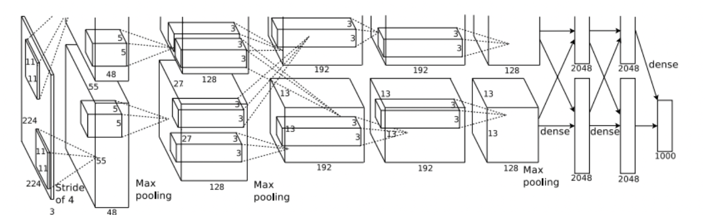
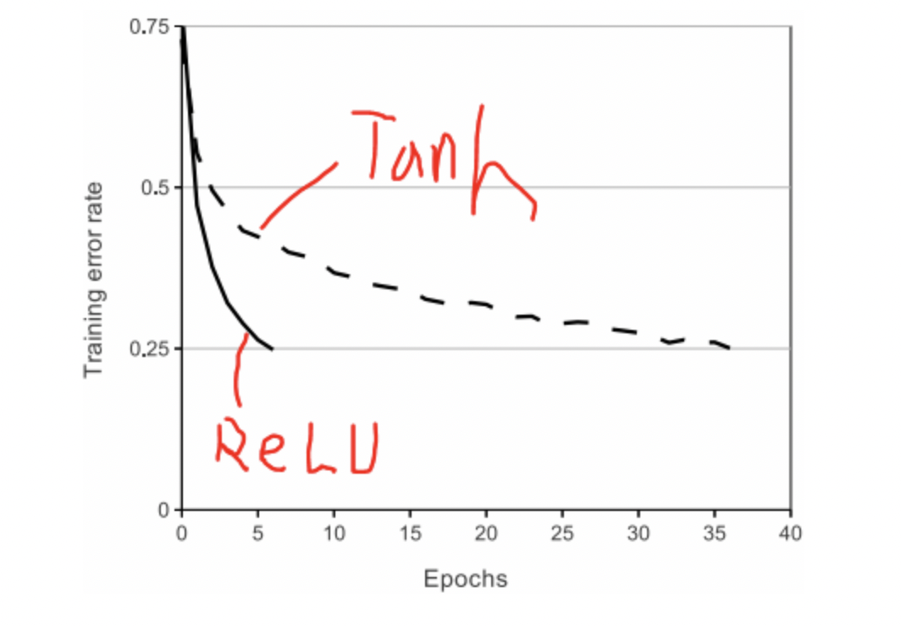
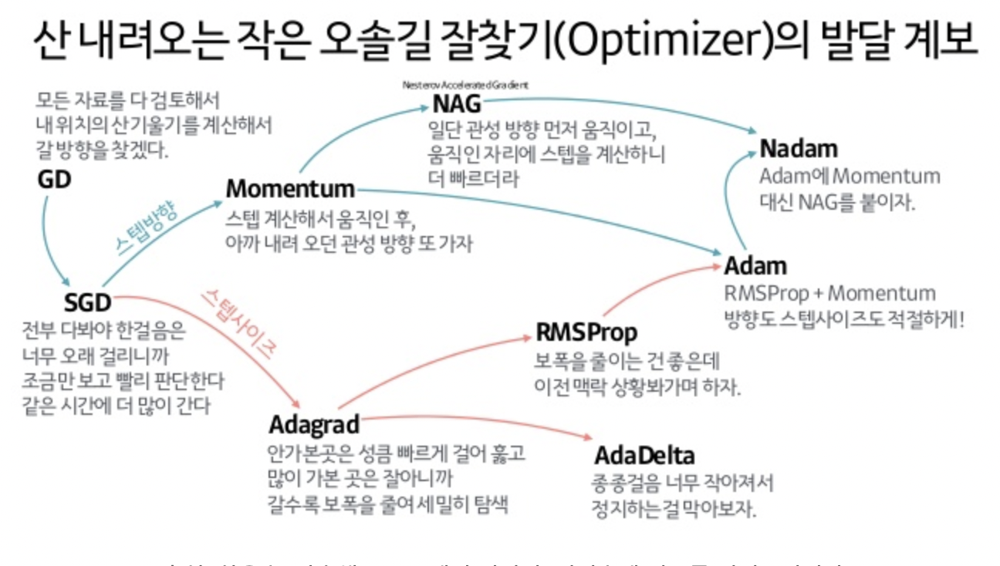

ImageNet Classification with Depp Convolutional Neural Networks
===========================
논문을 읽고 요약한 자료입니다.
--------------------------

- Imagnet Large Scale Visual Recognition Challenge 에서 Top 5 error 를 15.4%로 기록해 우수한 성적을 거둠
- 실제로 알렉스넷 덕분에 CNN 과 Dropout이 보편화 되었다고 할 수 있음
- 아래에 구체적으로 정리해봄

1. Dataset

* 22,000개 범주로 구성되어 있고 1500만개의 고해상도 이미지가 포함되어있는 data set    
* ILSVRC 대회는  ImageNet dataset의 subset을 이용하는데, 각 범주당 1000개의 이미지가 포함되어 있는 1000개 범주를 이용      
* 대략 120만개의 training 이미지와 50,000개의 validation 이미지, 150,000개의 testing 이미지로 구성     
* 이미지를 동일한 크기(256x256)으로 고정 => 나중에 FC layer의 입력 크기가 고정되어있어야 하기 때문임     
* resize 방법은 이미지의 넓이와 높이 중 더 짧은 쪽을 256으로 고정, 이후  중앙 부분을 256x256 크기로 crop       

----------------------------------
2. Network

* Input layer
> 224 x 224 x 3    

* Conv1

 > 96 kernels of size 11x11, stride=4, padding=0    
 > input : 224x224x3    
 > output : 55x55x96       

 
* MaxPool1

>  3x3 kernels, stride=2     
> input : 55x55x96       
> output : 27x27x96    

* Norm1

> LRN을 사용한 normalization layer
> normalization을 수행하는 layer      
> input : 27x27x96     
> output : 27x27x96      

 

* Conv2

> 256 kernels of size 5x5, stride=1, Padding=2      
> 논문의 그림에는 3x3 size의 kernel을 사용했다고 나오는데 논문의 그림이 잘못되었다고 함
> input : 27x27x96     
> output : 27x27x256   

 
* MaxPool2

> 3x3 kernels, stride = 2   
> input : 27x27x256   
> output : 13x13x256     

 

* Norm2 
 
> LRN을 사용한 normalization layer     
> input : 13x13x256   
> output : 13x13x256   

 

* Conv3   

> 384 kernels of size 3x3, stride=1, padding=1    
> input : 13x13x256     
> output : 13x13x384    

 

* Conv4

> 384 kernels of size 3x3, stride=1, padding=1    
> input : 13x13x384       
> output : 13x13x256    

 

* Conv5 

> 256 kernels of size 3x3, stride=1, padding=1   
> input : 13x13x384   
> output : 13x13x256   

 

* MaxPool3

> 3x3 kernels, stride=2   
> input : 13x13x256    
> output : 6x6x256     

 

* FC1

> fully connected layer with 4096 neurons   
> input : 6x6x256   
> output : 4096     

 

* FC2

> fully connected layer with 4096 neurons  
> input : 4096    
> output : 4096    

 

* output layer

> fully connected layer with 1000-way softmax   
> input : 4096   
> output : 1000   

 
* 아래와 같은 형태로 네트워크를 구성함

------------------------------
3. AlexNet 논문에서 주목할만한 특징 정리

* ReLu 사용

* GPU를 이용해서 평행하게 연산을 적용(FC 등, 중간에 합침)

* 2개의 GPU로 나누어서 학습시키니 top-1 erroe와 top-5 error가 1.7%, 1.2% 감소되었으며 학습속도도 빨라짐

* Local Response Normalization 을 이용함

> LRN은 generalizaion을 목적    
> sigmoid나 tanh 함수는 입력 date의 속성이 서로 편차가 심하면 saturating되는 현상이 심해져 vanishing gradient를 유발  
> 반면에 ReLU는 non-saturating nonlinearity 함수이기 때문에 saturating을 예방하기 위한 입력 normalizaion이 필요로 하지 않는 성질을 가짐  
>  ReLU는 양수값을 받으면 그 값을 그대로 neuron에 전달하기 때문에 너무 큰 값이 전달되어 주변의 낮은 값이 neuron에 전달되는 것을 막을 수 있음  
> 이것을 예방하기 위한 normalization이 LRN   

* Overlapping Pooling

> Pooling layer은 동일한 kernel map에 있는 인접한 neuron의 output을 요약
> stride < kernal size 방식으로 적용

----------------------------------
4. Overfitting 을 줄이기 위한 노력

* AlexNet에는 6천만개의 parameters가 존재   
* 이미지를 ILSVRC의 1000개 classes로 분류하기 위해서는 상당한 overfitting 없이 수 많은 parameters를 학습 시키는 것은 어려움

- Data Augmentation
> 1. 데이터 증가 => (상하좌우, 중앙) * 2배 좌우반전
> 2. altering the intensities of the RGB channels in training images   
>    이를 통해 조명의 영향과 색의 intensity 변화에 대한 불변성을 지닌다고 함

- Dropout
> dropout의 확률을 0.5로 설정하고 dropout된 neuron은 순전파와 역전파에 영향을 주지 않음
> 매 입력마다 dropout을 적용시키면 가중치는 공유되지만 신경망은 서로 다른 구조를 띄게 됨
> neuron은 특정 다른 neuron의 존재에 의존하지 않기 때문에 이 기법은 복잡한 neuron의 co-adaptation를 감소시킨다고 말함
> 그러므로 서로 다른 neuron의 임의의 부분 집합끼리 결합에 유용한 robust 특징을 배울 수 있다고 함

----------------------------------
5. Details of learning

* Stochastic gradient descent 적용

* batch size 는 128

* momentum, 0.9

* weight decay 0.0005 =>  regularize && Reduce model's training error  