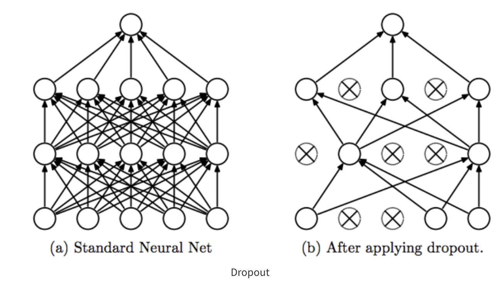
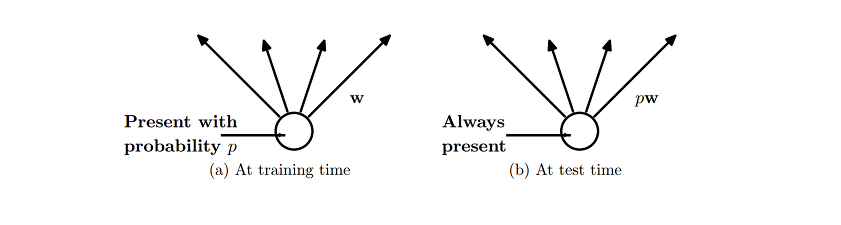
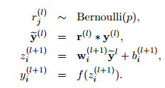
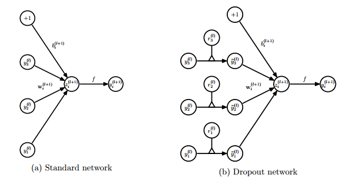
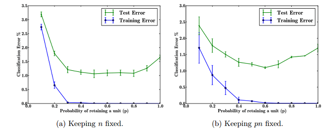

Dropout : A Simple Way to Prevent Neural Networks from Overfitting
=============
논문 읽고 요약한 자료 입니다.
-------------

### summary 

* DNN 이 깊어질수록, Parameters 는 많아지고 Overfitting 된다는 단점이 존재
* Dropout 을 통해 효과적으로 오버피팅을 최소화하고, 정규화 방식에 있어서 주요한 성능 향상을 이끌어낸다

### Description

</img>

* dropout 의 사전적 의미는 중퇴
* 뉴런들의 학습과정에서 일부 출력값들이 중퇴된다는 의미, 즉 업데이트 과정에 관여하지 않는다는 뜻
* 논문은 이것을 Dropping out units 라고 표현함
* 각각의 unit 들은 고정 확률 p를 가지고 있음 
* 이 값은 휴리스틱하게 네트워크나 데이터에 맞추어 설정하거나, 간단히 0.5 와 같은 설정을 할 수 있다

* 사용방법은 아래와 같음

</img>

> 각 뉴런이 존재할 확률 p를 가중치 w 와 곱해줘서 확률이 0 일 경우 동작하지 않음

</img>

> 수식은 위와 같음
> 맨 위의 수식은 베르누이 확률 같이라고 함
> 이 확률 값에 입력데이터를 곱함으로 일부 값은 0 이 되어 동작하지 않게된다. 이것은 편미분과정에서도 0 이 되어버려서 무시됨

</img>

* dropout nets 의 학습은 일반적인 NN 학습과 같이 SGD 를 사용하여 학습
* mini-batch 과정에서 드롭아웃을 사용한 것을 "thin network" 라고 표현함
* max-norm regularization + large decaying learning rates + hight momentum을 같이 사용하면 더 효과가 좋다고 한다

</img>

> p 값의 변화에 따른 test_err와 training error를 나타낸 값을 의미함
> 0.5 언저리 값을 사용하면 좋은 결과를 얻을 수 있다고 적힘

* 추후 Dropconnect와 관련된 논문을 참고