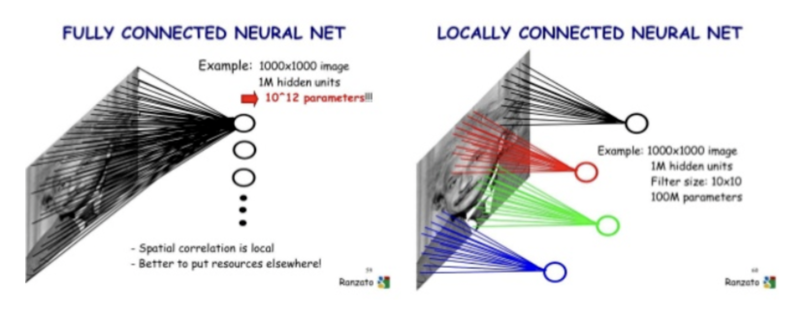
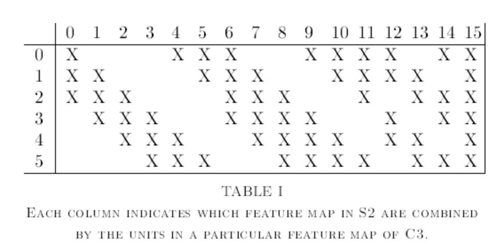

Lenet5 - Gradient based learning applied to document recognition 
=============
논문을 읽고 요약한 자료입니다.
-------------

Convolutional Neural Network의 발전 계기가 된 LeNet 아키텍쳐에 대해 설명하고 있는 논문

* 역전파 알고리즘으로 훈련된 다층 신경망의 경우, Gradient 기반 학습 기술에 있어서 좋은 성공 사례임을 보여줌
* 특히 손글씨와 같이 고차원의 패턴을 가진 데이터를 분류함에 있어서 적은 전처리만으로 좋은 성능을 보임 
* 이 논문에서는 손글씨를 인식함에 있어서 기존의 인식 방법과 비교한 결과를 리뷰함
* Convolutional Neural Network는 특히 2차원 형태의 데이터를 다루도록 고안되었는데, 다른 방법들보다 월등한 성능을 보여준다고 말함
* 실제 문서 인식 시스템에서는 여러가지 모듈들로 구성되어 있는데, 새로운 학습 페러다임인 GTN(Graph Transformer Networks)에 대해 설명
* 해당 GTN은 전체적인 성능 향상을 위해 여러 모듈들에 대해 Gradient 기반 학습
* 일반적인 fully-connected network에서 문자 인식에 대해 일부 성공하는 경우는 있었으나, 문제발생
* 입력 데이터로 사용되는 일반적인 이미지의 경우 사이즈가 크기 때문에 neural network에서 필요한 weight 파라메터의 개수가 커질 수 밖에 없고, 이는 메모리 사용량의 증대로 이어짐
* 입력 데이터의 경우 이미지 사이즈를 줄이거나 문자가 이미지 센터에 오도록 전처리를 하지만, translation(문자 위치 이동/회전 등), distortion(문자 형태 변형)에 대해 모든 경우를 고려하기 어렵움
* 한마디로 기존 fully-connected network의 경우 입력 데이터의 topology를 무시하고 학습함을 의미합니다. 따라서 기존 네트워크 모델의 경우는 원하는 성능을 내기 위해서는 더 많은 학습 데이터를 필요로함
* 2D 이미지의 경우 구성된 픽셀을 보면 edge나 corner와 같이 특정 부분(local feature)에 대한 서로 연관성이 높은 특징을 추출 할 수 있는데, CNN에서는 이러한 local feature에 대한 특징 추출을 통해 topology 문제를 해결

* CNN 의 대표적인 특징은 아래 3개와 같음

1. Local receptive fields 

2. Shared weights 

3. Sub-sampling => topology, translation..등 영향 적음

</img> 

- Layer C1

> 입력 데이터(32x32 1개)   
> 5x5 filter 6개를 통해 feature map 28x28 사이즈로 6개를 생성
> 여기서 filter 즉, 학습 가능한 파라메터의 개수는 156개
> 5x5(weight) x 6개 filter + 1(bias) x 6개 filter = 150 + 6 = 156개

----------------------

- Layer S2

> 입력 데이터(C1 feature map, 28x28 6개)로부터 2x2 filter 6개를 통해 14x14 feature map 6개를 생성
> 여기서 filter가 적용될때,  2x2 receptive field가 overlapping이 되지 않도록 적용
> average pooling을 수행함으로 weight 1개, bias 1개의 파라메터를 가지며, weight/bias가 추가된 결과에 최종적으로 sigmoid 함수가 적용.
> 학습 가능한 파라메터의 개수는 총 12개

2x2 filter => 1(weight, average pooling) x 6개 filter + 1(bias) x 6개 filter = 6 + 6 = 12개

----------------------

- Layer C3

> 입력 데이터(S2 feature map, 14x14 6개)로부터 5x5 filter 16개를 통해 10x10 feature map 16개를 생성
> 학습 가능한 파라메터의 개수는 총 1,516개입니다. 
> 6개의 데이터로부터 16개를 만드는데, 아래와 테이블과 같이 선택적으로 연결을 시키며 network의 symmetry한 성질을 없애기 위함
> convolution한 결과의 low-level feature가 각기 다른 부분과 섞여서 최종적으로 global feature를 얻어내기 위함이라고 함

5x5(weight)  x 60(S2 feature map과 C3 feature map간 connection수, 아래 테이블 X 표시 개수) + 1(bias) x 16개 filter = 1,516개

------------------------

</img> 

- Layer S4

> 입력 데이터(C3 feature map, 10x10 16개)로부터 2x2 filter 16개를 통해 5x5 feature map 16개를 생성
> 여기서 filter가 적용될때,  2x2 receptive field가 overlapping이 되지 않도록 적용
> average pooling을 수행함으로 weight 1개, bias 1개의 파라메터를 가지며, weight/bias가 추가된 결과에 최종적으로 sigmoid 함수가 적용
> 학습 가능한 파라메터의 개수는 총 32개

2x2 filter => 1(weight, average pooling) x 16개 filter + 1(bias) x 16개 filter = 16 + 16 = 32개

-------------------------

- Layer C5

> 입력 데이터(S4 feature map, 5x5 16개)로부터 5x5 filter 120개를 통해 1x1 feature map 120개를 생성(fully-connected) 
> 이전 단계에서 얻은 16개의 feature map이 서로 섞여서 1x1 feature map 120개로 만들어지게 됨
> 학습 가능한 파라메터의 개수는 총 48,120개입니다.

5x5(weight)  x 1,920(120 * 16) + 1(bias) x 120개 filter = 48,120개

---------------------------

- Layer F6

> 입력 데이터(S5 feature map, 1x1 120개)로부터 1x1 feature map 84개를 생성(fully-connected) 
> 따라서 이전 단계에서 얻은 120개의 feature map이 서로 섞여서 1x1 feature map 84개로 만들어지게 됨
> 학습 가능한 파라메터의 개수는 총 10,164개입니다.

120(weight) x 84개 filter + 1(bias) x 84개 = 10,164개

---------------------------

- Layer Output

> 최종적으로는 10개의 class로 구분
> 학습 가능한 파라메터의 개수는 총 850개
> 최종적으로 Output Layer에는 Euclidean Radial Basis Function units(RBF)가 적용

84(weight) x 10개 + 1(bias) x 10개 = 850개

